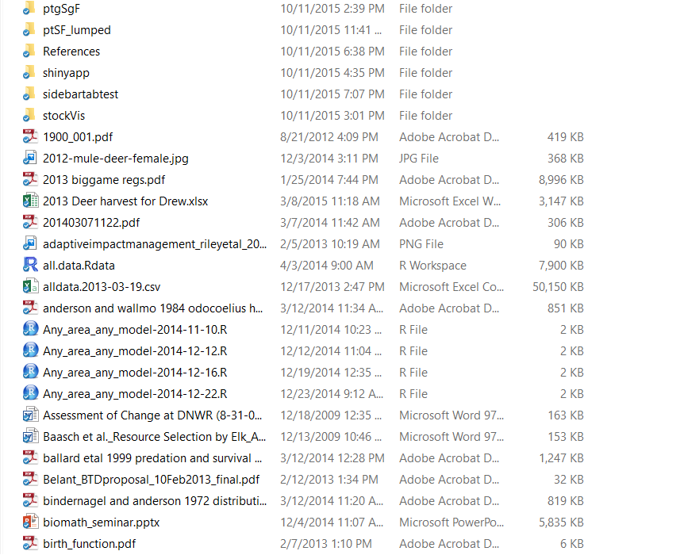
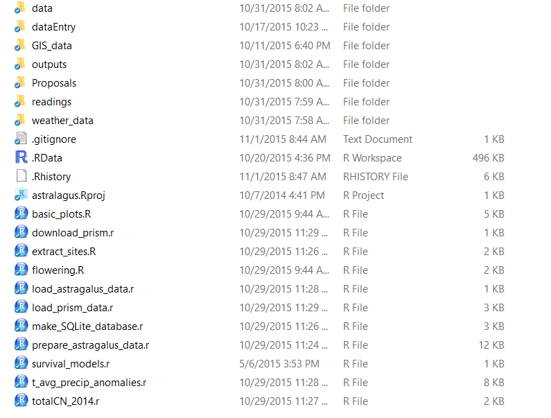

## Outline for the webinar
1. Why worry?
2. The big picture (from Christopher Gandrud's book on RR with R and RStudio) 
2. Organizing your workflow
3. Concept of a Source Document as the target of all work
4. Version Control & Collaboration
5. Wrapping up

## Why Worry? {.build}
- Personal Reasons -- Liz and the revisions
- Credibility
  * Stephen Heard's blogpost [Reproducibility, your methods, and 400 years of Angst](http://bit.ly/1wVSkmk) 
  * The 1^st^ leg of the science-policy interface (Cash et al 2003)
  
## The big picture (Gandrud, 2015)
- Everything is a (text) file
- All files should be human readable
- Document everything
- Plan the organization, storage and sharing of your files
- Explicitly tie files together

# Everything is a text file

## Write scripts!

- A script is a text file with commands for the computer
- Human readable
- Provides documentation for everything done to the data

## Don't trust the workspace

- best practice: rerun all code everytime you start working

# Organizing your workflow

## Bad Directory Structure


## Better Directory Structure


## Put everything in one directory
- All the code, data, outputs etc. 
- Make this directory an RStudio Project
- This will always be the "working directory"

## Use relative paths
- Breaks on another computer, OS, user
```
mydataframe <- read.csv(
"C:\\users\\Drew\\Box Sync\\Teaching\\noRinEntomology\\data\\e418.csv")
```
- Works with all OS, for any computer if directory is copied completely. Easier to read. 
```
mydataframe <- read.csv("data/e418.csv")
```

## NoSpaces
- spaces in filenames and directories cause problems for automation
- use camelBack style filenames for readibility
  - UpperCamelCase
  - lowerCamelCase 

## One useful structure
```
noRinEntomology
|   .Rhistory
|   LICENSE.md
|   noRinEntomology.html
|   noRinEntomology.rmd
|   noRinEntomology.Rproj
|   README.md
|   
+---code
|       custom.css
|       downLoadData.r
+---data
|       e418.csv
|
\---images
        good_directory_screenshot.png
        Ugly_directory_screenshot.png
        UNL-2C-TAG-small.png
```

## Why put code in a sub-directory?
- Reduces clutter
- Enables re-use between output documents
- Warning -- relative paths start from project working directory (usually!)

## Example: plot of species richness
```{r speciesRichness, message=FALSE}
source("code/downLoadData.r")
source("code/insectSpeciesRichness.r")
```

## Collaboration -- sharing with others
- sending code and data via email is fragile
- Use dropbox: download R file at this link:
http://bit.ly/1OhG7zR
- Code has direct link to data
```
blowflies <- source_DropboxData("blowflytest.csv","o0jguchss5vu2ct",                             sha1="12e7d4c54860cf9631c06923eab5f81d64d179c9",
                                cache=TRUE)
```
## More on Dropbox ... 
<div class="columns-2">
  <div class="centered">Good:</div>
  - upload new version with same name old version still available for 30 days (longer with paid account)
  - Can share an entire folder with collaborators -- all can upload/download
   
   
   

 <div class="centered">Bad:</div>
  - Old keys still point to old versions, even though updated version available
  - No documentation of what changed in new version
</div>


## 

## References

Cash et al (2003) Knowledge systems for sustainable development PNAS 100, 8086-8091.

Gandrud, C. (2015) Reproducible Research with R and RStudio. CRC Press, London.
  